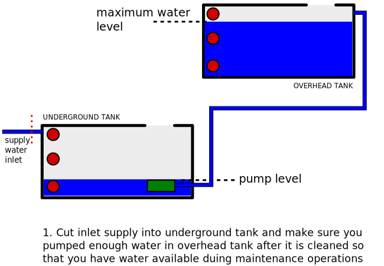
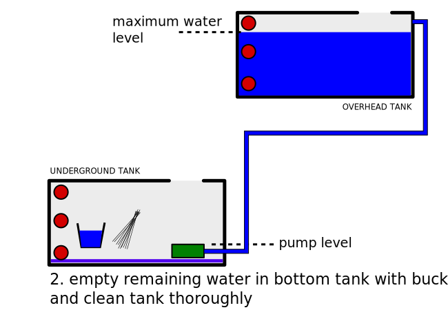
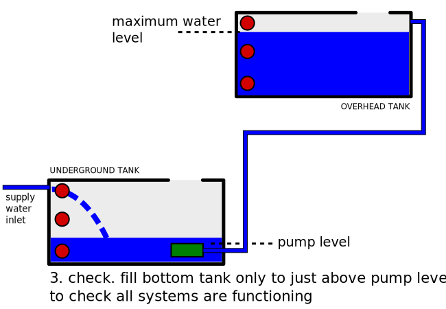
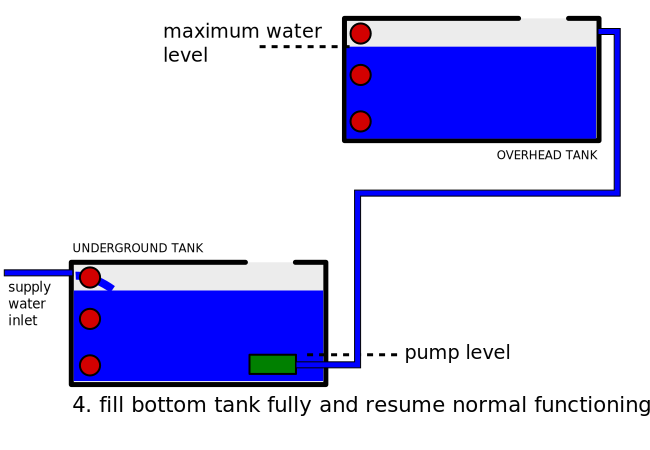

# Maintenance manual for cleaning water storage tanks

**Simple cleaning guidelines for water storage tanks in the society**

(this is a private manual for housing societies in Vrindavan, Vasind and may
not generally apply to your pumping system, if you are not the said housing
society)

**You mostly know this, just take care of Step 3, which is most crucial, and
most painful if missed; but feel free to follow along the whole guide**

----

## Step 0

**First things first**
 
*Clean the overhead tank first so that it is ready to use. This is easier to
empty and refill. Only electrical/electronics in this system are the water
level sensors usually. If there is something else in it, please refer to
another relevant manual for your system.*

----

## Step 1

Make sure you have enough water for use during maintenance operation.

Fill the overhead tank, and try to empty the underground tank to the level of
the pump. 

Depending on usage, you may need to overflow some water from the overhead tank.
For best results, schedule operations such that overhead tank is nearly empty
so that water wastage is minimised.

----

## Step 2

Cleaning of the bottom tank.

Remove water below pump level using buckets and clean the bottom tank.

----

## Step 3

This step is important.

It is essential to ensure your pumping system is working well before filling
the bottom tank fully again. 

If you fill the tank before filling and the pumping system fails, it will be
very hard labor and difficult to empty the tank manually.

----

## Step 4

Once you have checked the pumping system is working correctly with minimum
possible bottom tank level, fill the tank half and check pump again.

Once it is ensured that the pump is functional, fill bottom tank fully to 
resume normal operation.

----

*Maintenance manual for cleaning water storage systems. 
Created and maintained by*
[designr.in](https://desginr.in)

