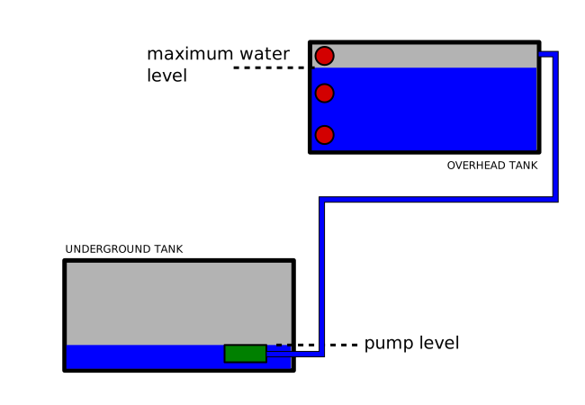

# Clean your pumping system - user manual for Rukmani Housing Society, Vasind

(this is a private manual and may not generally apply to your pumping system,
if you are not the said housing society)

Clean the overhead tank first so that it is ready to use. This is easier to
empty and refill. Only electronics in this sytem are the water level sensors
usually. If there is something else in it, please refer to another manual.

## Step 1

Make sure you have enough water for use during maintenance operation.

Fill the overhead tank first.

